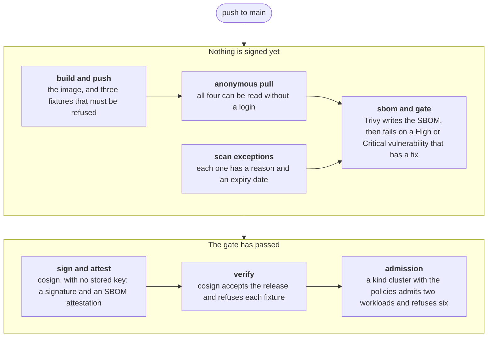

# signed-image-pipeline

[](https://github.com/shubhroses/signed-image-pipeline/actions/workflows/release.yml?query=branch%3Amain)

A cluster that runs Kyverno with the policies in [`policy/`](policy/) admits a Pod to the `apps` namespace only if every image in it carries a signature and an SBOM attestation made by this repository's release workflow on `main`, and that workflow signs an image only after Trivy has found in it no High or Critical vulnerability that has a fix, other than one accepted in writing for at most 90 days. That is a statement about where an image came from and what a scanner knew on the day it was built. It is not a statement that the image is safe: a vulnerability without a fix does not fail the scan (the release shown below passed it with 166 of them known, 31 rated High), nothing is revoked when a new one is found, and whoever can push to `main` can release anything that passes. No SLSA level is claimed.

The application is two HTTP endpoints and is only there to be shipped. The pipeline around it is the subject, and both of its paths are tested on every release: a throwaway kind cluster has to roll out the image that was just signed, and has to refuse six workloads that fall short of it, each by the control that is there to refuse it.

## How it works



Each box is a job of [`release.yml`](.github/workflows/release.yml), and a job runs only if the ones before it passed. The scan comes before the signature on purpose: it is what lets a signature mean "built by this workflow, and it passed the gate" and not just "built by this workflow". The three fixtures are the same image with one more label, so that each has a digest of its own: one is left unsigned, one is signed with a key made and deleted inside the job, and one is signed by the workflow and given no SBOM.

There are three workflows:

| Workflow | Runs | What it does |
|---|---|---|
| [`ci.yml`](.github/workflows/ci.yml) | every pull request and every push to `main` | ruff and pytest; hadolint; actionlint and shellcheck; gitleaks over the whole history; the check of the scan exceptions; `kyverno test` on the policies; a `docker build` without a push, a run of that image with a read-only root filesystem and no capabilities, and the Trivy gate. Under a minute. |
| [`release.yml`](.github/workflows/release.yml) | every push to `main`, and on demand | The seven jobs above. About five minutes. |
| [`rescan.yml`](.github/workflows/rescan.yml) | every Monday, and on demand | Fetches the attested SBOM of the latest release, scans it with that day's vulnerability database and opens an issue for each High or Critical vulnerability that has a fix. It rebuilds nothing, and a finding does not fail the run. Another job deletes test fixtures made more than 30 days before the newest. |

A push to a branch named `wip/…` starts all three as well, so that a change to a workflow can be rehearsed before it reaches `main`. A rehearsal of `release.yml` signs as its own branch, which nothing trusts ([Limitations](#limitations)). A rehearsal of `rescan.yml` is not a dry run: it reads the latest release of `main`, and it opens issues and prunes fixtures as a Monday run does.

## Verify the published image

Anyone can check a release, without a login and without a key. With [cosign](https://docs.sigstore.dev/cosign/system_config/installation/) installed, one command asks whether this image was signed by this repository's release workflow, run on `main`:

```sh
cosign verify \
  --certificate-identity https://github.com/shubhroses/signed-image-pipeline/.github/workflows/release.yml@refs/heads/main \
  --certificate-oidc-issuer https://token.actions.githubusercontent.com \
  ghcr.io/shubhroses/signed-image-pipeline@sha256:f2643461ef6f567aeaa387ef744d791ff02ace009495afc54969f7c02beee1dc
```

It exits 0 and says:

```text
Verification for ghcr.io/shubhroses/signed-image-pipeline@sha256:f2643461ef6f567aeaa387ef744d791ff02ace009495afc54969f7c02beee1dc --
The following checks were performed on each of these signatures:
  - The cosign claims were validated
  - Existence of the claims in the transparency log was verified offline
  - The code-signing certificate was verified using trusted certificate authority certificates
```

It also prints, as JSON, the two statements about the image that it found signed by that identity: one of type `https://sigstore.dev/cosign/sign/v1`, which is the signature, and one of type `https://spdx.dev/Document`, which is the SBOM attestation. Asked for any other identity it refuses: with `refs/heads/some-branch` in place of `refs/heads/main`, it exits 1 and says `expected SAN value "…@refs/heads/some-branch", got "…@refs/heads/main"`. Both answers are from cosign 3.1.3, the version the pipeline pins, and cosign 2.6.5 gave the same.

The image is the release built from commit `6989a71` by [run 16 of the release workflow](https://github.com/shubhroses/signed-image-pipeline/actions/runs/37981745142), and the other examples on this page are from the same run. A release cannot name its own digest in a file it is built from, so the one named here is never the newest. Any other release is checked the same way: every release is tagged with the full SHA of its commit, and `make verify` (below) checks the one built from the commit that is checked out.

The second command fetches the SBOM that the workflow attested and counts what it lists (it needs `jq`):

```sh
cosign verify-attestation --type spdxjson \
  --certificate-identity https://github.com/shubhroses/signed-image-pipeline/.github/workflows/release.yml@refs/heads/main \
  --certificate-oidc-issuer https://token.actions.githubusercontent.com \
  ghcr.io/shubhroses/signed-image-pipeline@sha256:f2643461ef6f567aeaa387ef744d791ff02ace009495afc54969f7c02beee1dc \
  | jq '.payload | @base64d | fromjson | .predicate.packages | length'
```

It prints `54`: the image, its operating system and the 52 packages Trivy found in it, 38 from Debian and 14 from PyPI.

Without cosign, `make verify` in a clone asks both questions with the pinned cosign, run from its container image. Besides git and make it needs only Docker:

```sh
git clone https://github.com/shubhroses/signed-image-pipeline.git
cd signed-image-pipeline
make verify
```

### What the signature is

No signing key is stored anywhere. For each signature cosign asks GitHub for a short-lived token that names the workflow file and the ref it is running on, and shows it to Sigstore's certificate authority, which issues a certificate for a key that exists for that one command. The certificate of the release above was valid for ten minutes and names the workflow, `refs/heads/main`, the commit and the issuer; it can be read in the public transparency log, at [entry 3170552949](https://search.sigstore.dev/?logIndex=3170552949). The signed statement, the certificate and the proof that the log recorded them are stored in GHCR next to the image.

So nobody needs a key from this repository to verify. They need to know which identity to expect, and the command above, the verify job and the admission policy all name the same one: `release.yml` of this repository on `refs/heads/main`, on the word of GitHub's token service. An attestation is made and stored the same way. Both are signed statements about one image digest; the signature says only "this identity signed this", and the attestation carries a document, here the SBOM.

## What each control stops, and what it does not

| Control | What it stops | What it does not stop | Which test proves it |
|---|---|---|---|
| **Scan gate**<br>Trivy, before anything is signed | Signing an image in which Trivy finds a High or Critical vulnerability that has a fix, or a High or Critical secret. A failure ends the run before the signing job. | A vulnerability that has no fix, or is rated Medium or Low. One that is published after the scan. One the vulnerability database does not know. | Job `sbom and gate` of `release.yml` on every release, and job `docker build and trivy` of `ci.yml` on every pull request. No CI job shows the gate failing: that was checked by hand, on an image with a fixable High finding and on one holding a token-shaped string. |
| **Scan exceptions**<br>[`.trivyignore.yaml`](.trivyignore.yaml), the one place where a finding can be accepted | An accepted finding with no written reason, no expiry date, or one more than 90 days ahead. A misspelt key, which Trivy skips in silence, leaving an exception permanent or wider than meant. | A reason that is wrong: the check is that one is written. Nothing here makes anyone review a change to the file; that takes branch protection, a repository setting. | Job `scan exceptions` of `ci.yml` and of `release.yml`, and the 36 unit tests of [`check_scan_exceptions.py`](scripts/check_scan_exceptions.py). The file is empty today, so CI has never seen Trivy apply an exception or drop an expired one; both were checked by hand. |
| **Keyless signature**<br>cosign, as "this workflow, on this ref" | An image that this workflow did not build on `main` passing as a release: one pushed by hand, built on a branch, or signed with somebody's own key. There is no signing key to leak. | Whoever can push to `main`: the workflow there is the trusted identity, and so is any change to it. It does not say that the tests passed either, because `release.yml` does not wait for `ci.yml`. | Job `verify`: cosign must accept the release under the trusted identity, its answer must hold a statement of the signature type, and the unsigned and the wrong-signer fixture must each be refused in cosign's own words. On a branch the same job requires the trusted identity to refuse the branch's image. |
| **SBOM attestation**<br>Trivy's SBOM of the image, signed the same way | A release without an SBOM that the workflow vouched for, or with one that describes another image. | What the scanner did not recognise is not in the list. And a list says what is in an image, not whether it is safe. | Job `verify`: `cosign verify-attestation` must pass, the SBOM must name the image it was fetched for and list each direct dependency at its locked version ([`check_sbom_dependencies.py`](scripts/check_sbom_dependencies.py), 21 unit tests), and the no-SBOM fixture must be refused. |
| **Image policy**<br>Kyverno, [`verify-release-image.yaml`](policy/verify-release-image.yaml) | In the `apps` namespace, a Pod with an image that lacks a signature by the release workflow on `main`, or an SBOM attested by it: an unsigned image, one signed by anybody else (this workflow on another branch included), one from any other registry. An image given by tag is stored with the digest the tag pointed to, so what runs is what was checked. | Anything outside `apps`. An ephemeral container added to a running Pod (`kubectl debug`), which is not checked until that Pod is next updated. Whoever may delete the policy or Kyverno. | Job `admission`, cases a to f, on every release. In `ci.yml`, job `kyverno test`: the policy must accept the release that `deploy/` pins, and must refuse an image from another registry, an image that this workflow built, signed and attested on a branch, and a Pod whose init container runs an image that is not a release. |
| **Pod Security Admission**<br>`restricted`, by two labels in [`namespace.yaml`](policy/namespace.yaml) | A Pod in `apps` that breaks the standard, which among other things forbids running as root, gaining privileges, keeping a capability and going without a seccomp profile. | What the standard has no rule for: which image runs, whether resources are limited, a writable root filesystem. | Job `admission`, case g, which tries one rule of the standard: `runAsUser: 0`. |
| **Requests and limits**<br>Kyverno, [`require-requests-and-limits.yaml`](policy/require-requests-and-limits.yaml) | In `apps`, a container or init container without a CPU and a memory request and limit. | Values that are set and are absurd: it checks that they are there, not what they are. | Job `admission`, case h. Job `kyverno test`: one Pod that must pass and four that must fail. |
| **Small image**<br>distroless, non-root, dependencies locked with hashes | A shell or pip in the running container, and a process that runs as root. The image needs no writable root filesystem and no capabilities, so `deploy/` grants neither. | A flaw in the application or in the Python interpreter. | Job `docker build and trivy` of `ci.yml`: the image must answer with a read-only root filesystem, no capabilities and no privilege escalation, and a check run inside it must find no root user, no pip and no shell. |
| **Weekly rescan**<br>[`rescan.yml`](.github/workflows/rescan.yml), with that day's database | Nothing. It reports: a High or Critical vulnerability with a fix in the latest release becomes an issue, once. | The image running, or being admitted again. It looks at the latest release only, once a week. | Each run first requires the scanner to report a package known to be vulnerable and to have read every package of the SBOM. Which findings become issues is decided by [`rescan_issues.py`](scripts/rescan_issues.py), which has 42 unit tests. |

The three admission controls follow one rule: built-in admission where it has a rule, Kyverno for what it cannot express. Running as root is refused by Pod Security Admission, which is part of Kubernetes and needs nothing installed. It has no way to say who must have signed an image or that a container must declare its resources, so those two are Kyverno policies. Kubernetes' own `ValidatingAdmissionPolicy` could express the second; it is a Kyverno policy here because Kyverno also gives it fixtures that run without a cluster (`kyverno test`) and derives the same check for Deployments and the other Pod controllers.

Two things are done everywhere and have no test of their own:

- **Pinned inputs.** GitHub Actions by commit SHA, both base images and every tool image by digest, Kyverno by chart version, Python dependencies by hash. The tools are pinned in one file, [`versions.env`](versions.env); cosign 3.1.3 and Kyverno 1.19.1 move as a pair, because Kyverno has to read what cosign writes. Not pinned: what comes with the runner, such as docker, kind, helm, jq and gh, and the images that Kyverno's chart names by tag. Dependabot proposes updates for the actions, the Python locks and the base images. Nothing updates `versions.env`.
- **Least privilege.** The token of every workflow is read-only unless a job asks for more, and five jobs do: `build and push` and `sign and attest` may write packages, and only the second may ask for the identity token that signing needs; in the rescan, one job may read workflow runs, one may write issues and one may delete package versions. The verify and admission jobs log in nowhere and read the registry as a stranger would.

## The accept and reject test

The admission job starts a kind cluster, installs Kyverno at the pinned version, applies [`policy/`](policy/) exactly as committed and offers the cluster eight workloads. Case a is [`deploy/`](deploy/) with the image that was just released. Each of the others is a Pod copied from that Deployment's Pod template with one thing changed, so a refusal is about the one change. A refusal counts only when the API server names the control that was expected to refuse, so a broken manifest cannot pass as a rejection.

These are the answers for the release above, on Kubernetes 1.35.8 with Kyverno 1.19.1:

| Case | Workload | Expected | What happened |
|---|---|---|---|
| a | `deploy/` at the released digest | Rolls out and becomes Ready | Rolled out: 2 of 2 replicas Ready, running the released digest |
| b | The same image referenced by tag | Admitted, and the stored Pod spec carries the digest | Admitted, and stored as `…:6989a71d…@sha256:f2643461…` |
| c | Unsigned fixture | Rejected by the image policy | `Policy verify-release-image failed: no signature by the release workflow on main` |
| d | Wrong-signer fixture | Rejected by the image policy | `Policy verify-release-image failed: no signature by the release workflow on main` |
| e | No-SBOM fixture | Rejected by the image policy | `Policy verify-release-image failed: no SBOM attested by the release workflow on main` |
| f | A public image from another registry (`registry.k8s.io/pause`) | Rejected by the image policy | `Policy verify-release-image failed: no signature by the release workflow on main` |
| g | The released image with `runAsUser: 0` | Rejected by Pod Security Admission | `violates PodSecurity "restricted:v1.35": runAsUser=0 (container "app" must not set runAsUser=0)` |
| h | The released image without resource limits | Rejected by the validate policy | `Policy require-requests-and-limits failed: every container must set CPU and memory requests and limits` |

Every release has to produce the same eight answers or its run fails. The summary of each [run of the release workflow](https://github.com/shubhroses/signed-image-pipeline/actions/workflows/release.yml?query=branch%3Amain) shows them next to the digest, the identity in each certificate, the transparency log entries and the scan totals. GitHub shows job summaries and logs only to visitors who are signed in, which is why the table is repeated here.

Cases c, d and f get the same answer, because Kyverno passes on the message of the check that failed and not the reason it failed. The reasons are in the admission controller's log, which the job prints and does not assert on: `no matching attestations` for the unsigned fixture, `transparency log certificate does not match` for the wrong-signer fixture. The image in case f is signed by its publisher in cosign's older layout, and the log says of it what it says of the unsigned fixture. So no case offers the cluster a complete signature and SBOM attestation made by another keyless identity. `kyverno test` covers that, without a cluster: one of its fixtures is an image that this workflow built, signed and attested on a branch, and the policy has to refuse it.

The test has also been seen to fail. [A run on a throwaway branch](https://github.com/shubhroses/signed-image-pipeline/actions/runs/37972598768) took an earlier version of the policies and weakened three controls on purpose: the image policy matched only `ghcr.io/shubhroses/*`, the namespace enforced `baseline`, and the validate policy no longer asked for limits. Cases f, g and h were admitted and the job failed, as did `kyverno test` in the `ci` run of the same commit; the other five cases went as expected. That run also tried what the eight cases do not: a Deployment with the unsigned fixture was refused when it was submitted, an ephemeral container with that image was admitted, the next update of its Pod was refused, and a Pod with that image in another namespace was admitted. These are the two failed runs on the branch `wip/s5-negative` in the list of runs.

## Limitations

**What a signature does not mean**

- Not that the image is safe. The scan that the release above passed listed 166 vulnerabilities without a fix: 31 High, 82 Medium and 53 Low. A vulnerability fails the gate only when it is High or Critical and has a fix.
- Not that the tests passed. `release.yml` does not wait for `ci.yml`.
- Not that the build can be repeated. Two runs on the same commit produced two different digests. A signature ties a digest to a run of the workflow; nobody can rebuild the image to check it byte for byte.
- `cosign verify` alone does not tell a signature from an attestation: it accepts any statement about the image that the identity signed, and its output above lists the SBOM attestation next to the signature. The verify job and the admission policy therefore ask for the two statement types by name.

**What every run depends on**

- Signing needs GitHub's token service, Sigstore's public instance (its certificate authority, its transparency log, its timestamp authority and the mirror of its trust root) and GHCR. Verifying needs GHCR and the trust root. None of these is under this repository's control.
- Most steps that only fetch or send something are tried three times, 10 and then 20 seconds apart. A check that has to fail is asked once, because a refusal is an answer. An outage longer than that fails the run.
- In a real cluster the image policy makes the same services part of admission: creating a Pod in `apps` needs GHCR and the trust root to be reachable, and in the run above each such request took one or two seconds. What happens while one of them is down was not tested.
- Every release writes four entries to Sigstore's public transparency log, and they cannot be removed. Three of them name this repository, the workflow file and the ref.

**What a pull request cannot test**

- A pull request never starts `release.yml`: every run of it publishes images, and a pull request does not have the identity of `main`, so it could not make the trusted signature. The accept and reject test therefore runs after a merge, and a change that breaks it turns `main` red, not the pull request.
- What a pull request does run is `ci.yml`, in which `kyverno test` asks the image policy as committed about real images: the release that `deploy/` pins, an image from another registry and one that the release workflow signed on a branch. Nothing makes a green `ci.yml` or a review a condition of merging: that takes branch protection, a repository setting, which was not switched on when this was written.
- A change to the workflow or to a policy can be rehearsed first: a push to a branch named `wip/…` runs the whole of `release.yml`, with the branch's own identity put in place of `main`'s in a copy of the image policy. That proves the mechanics and not the trust. Nothing admits what a rehearsal signs, and its images stay in the registry next to the releases.
- A rehearsal tags its image with its commit, as a release does and in the same package. A branch pushed at a commit that `main` has already released would therefore move that release's tag to the rehearsal's image. Nothing trusts a tag: `make verify` and the rescan would then fail on the signer, and `deploy/` pins a digest.

**What follows from the gate**

- When a fix is published for a High or Critical vulnerability that is already in the image, the next push to `main` fails the gate, and `main` stays red until the fixed package or base image is merged. That is intended. Dependabot proposes such an update on a Monday, and for most sources not until the new version is three days old, so `main` can be red for days.
- The weekly rescan reports and stops nothing. It reads the latest release, not the one `deploy/` pins: that digest is moved by hand and is always at least one release behind.

**Others**

- The policies have only ever run in the kind cluster that each release creates and throws away. Nothing here has run in a long-lived cluster.
- The image is built for linux/amd64 only.
- GitHub disables a scheduled workflow in a public repository after 60 days without activity in it, and the rescan is one.
- On 2026-10-09, when this was written, some paths had never run for real. No finding had made the rescan open an issue, and no fixture was old enough to be pruned on `main`. No pull request had been opened, so `ci.yml` had run only on pushes and Dependabot's first update was still to come. `make admission` had run only as the three steps the release workflow makes of it.

## Run it locally

```sh
make verify      # who signed the image built from this commit, and who attested its SBOM
make scan        # build the image and run the scan gate on it
make test        # the unit tests, the check of the scan exceptions and kyverno test
make admission   # the eight cases, on a kind cluster of its own
```

- `make verify` and `make scan` need Docker. `make verify` works on a commit of `main` once its release run has finished; `make verify RELEASE=ghcr.io/shubhroses/signed-image-pipeline@sha256:…` checks any other image.
- `make test` also needs Python 3.13 with the locked dependencies, and the network, because `kyverno test` asks the image policy about real images:

  ```sh
  python3.13 -m venv .venv && . .venv/bin/activate
  pip install --require-hashes --requirement app/requirements.txt --requirement app/requirements-dev.txt
  ```

- `make admission` also needs kind, kubectl, helm and jq. It makes a cluster named `signed-image-pipeline`, writes its credentials to `.cache/kubeconfig` inside the repository and names that file or its context in every command, so no other cluster and no other kubeconfig is touched. It tests what the release workflow published for the commit that is checked out, and deletes the cluster when all eight cases went as expected. The image is linux/amd64, so on Apple silicon the cluster has to emulate it, which has not been tried.

Signing has no local target. The trusted identity is the workflow, so a signature made anywhere else would not be the one the policy asks for.

## What is where

| Path | What it holds |
|---|---|
| [`app/`](app/) | The service: two endpoints, their tests and the locks with hashes |
| [`Dockerfile`](Dockerfile) | A two-stage build onto a distroless base, both stages pinned by digest |
| [`.github/`](.github/) | The three workflows, and what Dependabot is asked to keep up to date |
| [`.trivyignore.yaml`](.trivyignore.yaml) | The scan exceptions. There are none today |
| [`policy/`](policy/) | The namespace, the two Kyverno policies and their `kyverno test` fixtures |
| [`deploy/`](deploy/) | The Deployment and the Service, pinned to a released digest |
| [`scripts/`](scripts/) | What the workflows and the Makefile call, with unit tests |
| [`versions.env`](versions.env) | Every tool image and version, pinned in one place |
| [`Makefile`](Makefile) | The local targets |

## Licence

[MIT](LICENSE)
